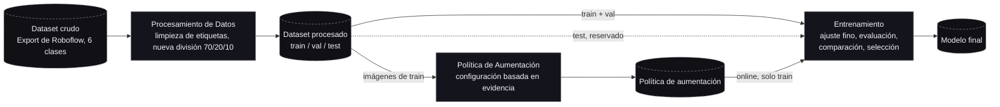

## Visión General del Pipeline

Tres etapas: limpiar y dividir los datos, definir una política de aumentación, y luego ajustar (fine-tune)
y seleccionar un detector sobre un backbone preentrenado.

**Estado:** Procesamiento de Datos terminado. Política de aumentación definida, aún no evaluada en un
entrenamiento. Entrenamiento no iniciado.

### 1. Procesamiento de Datos

- Se limpió el export crudo antes que nada: se descartaron imágenes corruptas y se corrigieron o
  eliminaron anotaciones incorrectas, ya que un export de Roboflow puede traer errores de etiquetado que
  de otro modo perjudicarían el entrenamiento de forma silenciosa.
- Se re-dividió el dataset por nuestra cuenta (70/20/10) en lugar de mantener el split de Roboflow: el de
  ellos resultó desparejo entre clases, lo que habría hecho inútil la evaluación por clase.
- El conjunto de test queda reservado y no se toca hasta la evaluación final.

### 2. Política de Aumentación

- Se eligieron las técnicas de aumentación midiendo primero los datos procesados (brillo, desenfoque,
  color, balance de clases).
- Hallazgos principales: al dataset le faltan imágenes oscuras o borrosas como las que tendría un video
  real de la cinta transportadora; algunas clases se distinguen principalmente por color; el
  "desbalance" de clases se debe a cuántos objetos aparecen por foto, no a cuántas fotos hay por clase.
- Se aplica **online** durante el entrenamiento (una configuración compartida, no una copia reescrita del
  dataset): esto mantiene a todo el equipo sincronizado y garantiza que el conjunto de test no pueda
  aumentarse por accidente.
- Se definió una pequeña ablación (con vs. sin nuestros cambios) para medir el beneficio.

### 3. Entrenamiento — no iniciado

- Fine-tuning de YOLO preentrenado (YOLOv8n, YOLO11n) en lugar de entrenar desde cero: necesita mucho
  menos datos y más eficiente.
- Evaluación con mAP, curva PR y matriz de confusión: la matriz de confusión es la más relevante para un
  caso de uso de clasificación de residuos, ya que muestra qué materiales se confunden entre sí.
- Comparación de ambas variantes de YOLO en precisión y velocidad de inferencia, y selección del mejor
  compromiso.
