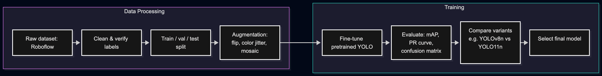

## Pipeline Overview

The pipeline has two phases: preparing the data, then training the detector on top of a pretrained backbone.

### Data Processing

Starting point is the Roboflow `garbage-classification-3` dataset. Before training, the raw export goes through:

- **Clean & verify labels** — check for mislabeled, missing, or duplicate annotations. Roboflow exports can carry labeling errors that would otherwise silently hurt training.
- **Train / val / test split** — a held-out validation set guides model/hyperparameter choices, while the test set stays untouched until the final, unbiased metric report.
- **Augmentation (flip, color jitter, mosaic)** — compensates for the dataset's likely lack of real-world variation (lighting, clutter, partial occlusion) and helps offset class imbalance between material types. Mosaic is YOLO's native technique of stitching 4 images into one, which improves small-object detection and background diversity.

### Training

- **Fine-tune pretrained YOLO** — start from COCO-pretrained weights instead of training from scratch. The backbone already knows general visual features (edges, shapes, textures), so fine-tuning only has to adapt it to the waste classes, needing far less data and compute. This is also what the course rubric asks for: building on pretrained models rather than training a new architecture.
- **Evaluate: mAP, PR curve, confusion matrix** — mAP is the standard detection metric (precision/recall averaged across classes and IoU thresholds); the PR curve exposes per-class precision/recall tradeoffs; the confusion matrix shows which materials get mixed up with each other (e.g. visually similar plastics) — directly relevant to a sorting use case, since that's exactly the failure mode that matters.
- **Compare variants (YOLOv8n vs YOLO11n)** — benchmark both on accuracy *and* inference speed, not accuracy alone. This comparison doubles as the "why did you choose X over Y" justification the course explicitly requires.
- **Select final model** — pick the variant with the best accuracy/speed tradeoff for the project's constraints, backed by the benchmark numbers from the previous step.
