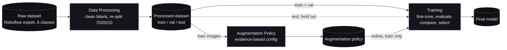

## Pipeline Overview

Three stages: clean and split the data, decide an augmentation policy, then fine-tune and select a
detector on top of a pretrained backbone.

```mermaid
flowchart LR
    raw[("Raw dataset<br/>Roboflow export, 6 classes")]
    dp["Data Processing<br/>clean labels, re-split 70/20/10"]
    processed[("Processed dataset<br/>train / val / test")]
    aug["Augmentation Policy<br/>evidence-based config"]
    policy[("Augmentation policy")]
    tr["Training<br/>fine-tune, evaluate,<br/>compare, select"]
    model[("Final model")]

    raw --> dp
    dp --> processed
    processed -- "train images" --> aug
    aug --> policy
    processed -- "train + val" --> tr
    processed -. "test, held out" .-> tr
    policy -- "online, train only" --> tr
    tr --> model

    classDef stage fill:#14141c,stroke:#6e6e7a,color:#f2f2f5;
    classDef artifact fill:#101015,stroke:#8a8a96,color:#f2f2f5,stroke-dasharray:4 3;
    class dp,aug,tr stage
    class raw,processed,policy,model artifact
```

**Status:** Data Processing done. Augmentation policy decided, not yet trained against. Training not
started.

### 1. Data Processing

- Cleaned the raw export before anything else — dropped corrupt images and fixed/dropped bad annotations,
  since a Roboflow export can carry labeling errors that would otherwise silently hurt training.
- Re-split the data ourselves (70/20/10) instead of keeping Roboflow's split — theirs turned out uneven
  across classes, which would have made per-class evaluation meaningless.
- Test set is held out and untouched until final evaluation.

### 2. Augmentation Policy

- Chose augmentations by measuring the processed data first (brightness, blur, color, class balance).
- Main findings: the dataset is missing dark/blurry images real belt footage would have; some classes are
  told apart mostly by color; the class "imbalance" is about how many objects appear per photo, not how
  many photos exist per class.
- Applied **online** during training (a shared config, not a rewritten copy of the dataset) — this keeps
  the whole team in sync and guarantees the test set can't accidentally get augmented.
- Defined a small ablation (with vs. without our changes) so the benefit gets measured.

### 3. Training — not started

- Fine-tune pretrained YOLO (YOLOv8n, YOLO11n) instead of training from scratch — needs far less data and
  compute, and matches what the course asks for.
- Evaluate with mAP, PR curve, and a confusion matrix — the confusion matrix matters most for a sorting
  use case, since it shows which materials get mixed up.
- Compare both YOLO variants on accuracy and inference speed, then pick the best tradeoff.
